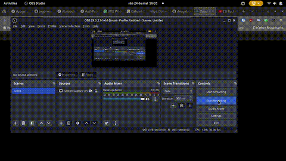

# 🌐 YouTube Video Downloader (Web)

This is a **web client** built with **React** that allows you to download YouTube videos using a link or video ID. It connects to a backend API that uses `yt-dlp`. This project was developed as an extension of the [mobile version](https://github.com/newthiagoassisk8/youtube-video-downloader), with a focus on learning front-end development with React for the web.

## 🔁 Mobile Version

If you're looking for the **mobile version**, check out the repository below:

📱 [YouTube Video Downloader - React Native](https://github.com/newthiagoassisk8/youtube-video-downloader)

## 📡 Backend API

The API used by both versions is available in this repository:

🔧 [https://github.com/newthiagoassisk8/ytb-api](https://github.com/newthiagoassisk8/ytb-api)

## 📸 Demo



## ⚙️ How to Run the Project

```bash
# Install dependencies
npm install

# Start the project
npm start
```
